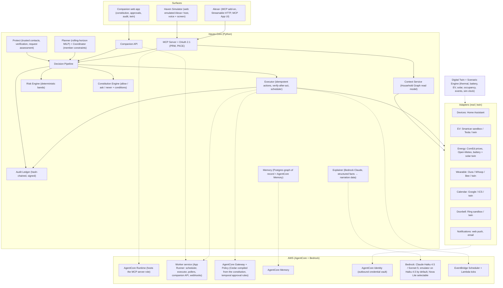

# Haven

**The bounded-autonomy operating system for the home.** Haven turns Alexa+ from a command-driven assistant into a permissioned household agent: it holds a shared model of the people, devices, schedules, energy, and trust relationships in a home, plans against household goals instead of one-off commands, and acts only inside boundaries the household wrote down.


*Observe → Understand → Plan → Evaluate Risk → Check Authority → Act → Verify → Remember. Every action Haven takes passes through that loop, and every step of it is recorded.*

> Built for the **Build, Ship, Shape: Amazon Developer Hackathon 2026** — Alexa+ track (primary), Ring track (secondary, kept only if the Ring sandbox access gate in `ROADMAP.md` item 34 passes), AWS Builder mini-challenge. Designed as a startup, not a weekend project: see [`ROADMAP.md`](./ROADMAP.md) for the hackathon cut line and what comes after it.

---

## Why

Today's smart home follows commands. You say "set the thermostat to 72", "charge the car", "remind Mom about her pills", "add milk". The assistant executes each one in isolation. It has no model of who lives in the house, what they need tonight, what electricity costs at 6 PM, which requests are normal and which are dangerous, or how much authority it has been given.

Alexa+ can now call third-party tools over MCP, orchestrate multi-turn conversations, and render interactive UI. Household agents built on it already follow a common pattern: an allowlist of actions, a human-approval step for the risky ones, and an audit trail. That pattern is necessary and Haven has it. It is not sufficient, for three reasons:

1. **The boundary is the developer's, not the household's.** An allowlist is written in code by whoever built the agent. A family that can unlock doors, move money, and change the thermostat while someone sleeps needs to *write* the answer to "how much authority do you have?" themselves, change it, and see proof that it was enforced somewhere the agent cannot reach.
2. **One user, one command at a time.** Preferences, routines, people, assets, and constraints live in ten apps and nobody's head. Nothing plans across Mom's comfort, the car's deadline, tonight's prices, and Dad's "kitchen is busy until 11" in one decision, with numbers it can defend.
3. **Trust comes from the caller.** The same channel that takes "turn off the lights" also takes "Dad's stranded, send money to this number". An assistant with no record of who Dad is and how to reach him can only take the caller's word for it.

Haven's thesis is **bounded autonomy**: understand the household, negotiate competing needs, take safe autonomous action inside a boundary the household wrote, and know when to ask.

## What it does

You get home at 5:30 PM.

> **You:** Alexa, what's going on tonight?
>
> **Alexa (Haven):** You're home earlier than usual. Your parents are coming at 7, the car is at 34 percent, and electricity prices spike at 6. I can pre-warm the living room for your mom, charge the home battery before prices rise, hold the car until the cheap window after midnight, and have everything ready by 7. On your rate the dollar saving is small; the bigger win is keeping the evening peak off the grid, and the numbers are on the card.

The screen shows the plan as a card: each action, when, why, and the numbers. You approve it, or change it by voice ("I'm not driving tomorrow, 50 percent is fine"), and the plan re-optimizes.

At 6:15 the phone rings.

> **You:** Alexa, send five hundred dollars to this number. It's for Dad, he's stranded.
>
> **Alexa (Haven):** I can't send money; your household rules never allow it. And this request has the pattern of a family impersonation scam: urgency, money, and a number that isn't one of Dad's verified contacts. I can check with Dad through his own Haven app, or call his verified number. Want me to?

Dad taps "I'm fine" on his phone. Haven refused the request under a rule the household wrote, and never used anything the caller said as a fact. The same flow protects a parent living alone whose Echo is linked to their own Haven.

Next morning:

> **Alexa (Haven):** Good morning. Overnight I charged the car to 52 percent in the 1 AM window, ran the dishwasher after your dad finished in the kitchen, and kept the house within your comfort band. The scorecard has yesterday's peak kilowatt-hours avoided and the cost saved. One request was flagged and verified, and one action asked for your OK under your own rule.

Every one of those sentences is backed by a structured record: what Haven did, why, under which rule of the household constitution, at what risk band, and who approved it. Every number Haven speaks comes from a cited scenario run against real price and weather data; on a flat real-time tariff like ComEd's the nightly dollar saving is modest and Haven says so, which is why the scorecard leads with peak kilowatt-hours avoided.

## What Haven adds

Approval gates, an audit ledger, and a simulated Alexa+ host are the baseline for a household agent, and Haven has all three. The four things below are what Haven adds on top of that baseline.

| | What it is | Why it matters |
|---|---|---|
| **Household Constitution, compiled to Cedar, enforced twice** | A document the household writes, as a form, as YAML, or in plain English, stating per action class and per member what Haven may do on its own, what it must ask about, and what it may never do. Every version compiles to a Cedar/Dogwood policy set that AgentCore Policy enforces at the AWS tool boundary, outside Haven's process, including a temporal "approval must precede action" rule. | The boundary belongs to the family, not the developer, and the proof that it held comes from an engine the agent cannot reach. |
| **A real planner over real prices** | A rolling-horizon MILP schedules the EV, the home battery, HVAC, and appliances against live utility prices and weather, per-occupant comfort bands, and member constraints, and reports savings against a baseline plan solved with the same model. A physics twin supplies every device that is not real, labeled as such. | The savings on the scorecard are computed, not typed, and the binding constraints and rejected alternatives are outputs of the model rather than a story about it. |
| **Multi-member coordination with provenance** | Each member's constraints and preferences keep their owner and time: "Dad, 22:40: kitchen in use until 23:00" survives into the plan, the explanation, and the audit row. Conflicts between members are returned as data with the people involved, never silently resolved. | A household is not one user. The plan can say whose request moved the dishwasher, and why. |
| **Verification from the household's own records** | Trusted contacts have channels verified out of band at setup. A request is checked against those records and confirmed through the subject's own app or verified number, never through anything the caller supplied. Money never moves; the classes exist so the constitution can forbid them provably. | "Is this really Dad?" is answered by the graph, not by the person asking. |

Underneath all four: a deterministic risk engine whose bands set floors the constitution can tighten but never loosen, and a pipeline in which every action carries what, why, which rule, and what was rejected, as data that Alexa narrates. Those are the mechanisms that make the four hold; they are not the claim.

## Architecture

Every box is a module described in [`ARCHITECTURE.md`](./ARCHITECTURE.md). Surfaces talk to Haven Core only through MCP tools or the companion API; Core talks to the world only through adapters, each of which has a real implementation and a **digital-twin** implementation behind the same interface.



**The decision pipeline, in order.** A proposed action is resolved by one deterministic, ordered pipeline (full detail in `ARCHITECTURE.md` §3):

```
1. Identity + role resolution      → unknown requester → least authority
2. Constitution NEVER              → DENY (terminal)
3. Risk floor                      → CRITICAL → DENY or VERIFY (terminal)
4. Constitution mode + conditions  → auto | ask | never
5. Risk band escalation            → HIGH forces ASK even where the constitution says auto
6. Budgets and rate limits         → daily $ limit, action counts → ASK or DENY
7. Boundary enforcement (Cedar)    → AgentCore Policy must agree; disagreement fails closed
8. → EXECUTE | ASK | DENY | VERIFY
```

## Tech stack

| Layer | Choice | Why |
|---|---|---|
| Core | Python 3.12, FastAPI, official `mcp` SDK (FastMCP), async throughout | First-party MCP SDK; same stack as the author's prior MCP work; AgentCore Runtime's MCP contract is Python-first |
| Planner | `scipy.optimize.milp` (HiGHS) rolling-horizon scheduler | Deterministic, explainable, one dependency; no LLM in the optimization loop ([ADR-005](./docs/adr/ADR-005-deterministic-planner.md)) |
| Policy | YAML constitution + Pydantic schema + a non-Turing-complete condition grammar, compiled to Cedar | Git-diffable, validated at load, analyzable; enforced in-process and at the AWS tool boundary ([ADR-003](./docs/adr/ADR-003-constitution-yaml-to-cedar.md)) |
| Risk | Fixed action-class table + dynamic factors, **no ML** | A household decision the family can't explain is one they can't trust ([ADR-004](./docs/adr/ADR-004-no-ml-risk-scoring.md)) |
| Storage | PostgreSQL 16 (household graph, constitution versions, plans, approvals, audit chain) + AgentCore Memory (conversational, preference extraction) | Relational integrity for a hash chain; graph as tables + JSONB ([ADR-002](./docs/adr/ADR-002-postgres-over-dynamodb.md)) |
| Surfaces | React + TypeScript: MCP App (`@modelcontextprotocol/ext-apps`), companion app, simulator | The MCP Apps SDK and the Alexa tooling are TypeScript ([ADR-001](./docs/adr/ADR-001-python-core-typescript-surfaces.md)) |
| Alexa+ | MCP 2025-11-25, Streamable HTTP, OAuth 2.1 + PKCE S256, Protected Resource Metadata, MCP Apps for visuals | The add-on contract, verbatim ([ADR-007](./docs/adr/ADR-007-alexa-surface-strategy.md)) |
| AWS | AgentCore Runtime, Gateway, Policy, Memory, Identity; Bedrock (Claude Haiku 4.5 / Sonnet 5; the emulator runs Haiku 4.5 by default with Nova Lite selectable); EventBridge Scheduler + Lambda; CDK (TypeScript) | AWS runs Haven's agentic state and enforcement, not just its hosting ([ADR-008](./docs/adr/ADR-008-agentcore-topology.md)) |
| Twin | Physics-lite models with a simulated clock and a YAML scenario DSL | Everything is demonstrable end to end with no hardware, and every scenario is an integration test ([ADR-006](./docs/adr/ADR-006-twin-first-adapters.md)) |
| Ops | Docker Compose (Postgres, Home Assistant demo, Haven), OpenTelemetry → CloudWatch via AgentCore Observability, GitHub Actions (ruff / mypy strict / pytest 80% gate / tsc / vitest / playwright) | |

## Repository layout

```
Haven/
├── README.md, ARCHITECTURE.md, THREAT_MODEL.md, ROADMAP.md, SECURITY.md, CHANGELOG.md
├── CLAUDE.md, AGENTS.md            # instruction files for coding agents (kept at parity)
├── docs/
│   ├── adr/                        # one file per consequential decision
│   ├── constitution.md             # the Household Constitution spec
│   ├── tool-catalog.md             # every MCP tool: name, schema, output, voice fallback
│   ├── twin-and-scenarios.md       # digital twin models and the scenario DSL
│   ├── demo-script.md              # the 3-minute video, beat by beat
│   └── submission.md               # hackathon requirements checklist
├── haven/                          # Python core package
│   ├── graph/                      # household graph models, repository, versioning
│   ├── constitution/               # schema, loader, condition grammar, Cedar compiler, evaluator
│   ├── risk/                       # action classes, factors, bands
│   ├── pipeline/                   # the decision pipeline and the canonical Decision
│   ├── planner/                    # MILP scheduler, coordinator, plan diff
│   ├── executor/                   # action runtime, scheduler, verify-after-act
│   ├── protect/                    # trusted contacts, verification, request assessment
│   ├── explain/                    # Bedrock-backed explainer (structured in, structured out)
│   ├── audit/                      # hash chain, signing, export, verifier
│   ├── adapters/                   # one package per domain; each has real/ and twin/
│   ├── twin/                       # physics models, sim clock, scenario engine
│   ├── mcp/                        # MCP server, tools, OAuth PRM, MCP App resources
│   ├── api/                        # companion API (FastAPI)
│   └── cli.py                      # haven CLI: decide, plan, scenario, verify-audit, doctor
├── apps/
│   ├── mcp-app/                    # React MCP App bundle (plan card, approval card, verification card, scorecard)
│   └── web/                        # one React app: companion pages + the Alexa+ simulator route (emulator agent, voice, device modes)
├── infra/cdk/                      # AWS CDK (TypeScript): AgentCore, Cognito, Bedrock access, scheduler, RDS
├── scenarios/                      # YAML scenarios (the demo evening, test fixtures)
├── constitutions/                  # example constitutions incl. the demo household
├── compose.dev.yml, compose.demo.yml
├── alembic/                        # Postgres migrations
├── scripts/
└── tests/{unit,integration,adversarial,scenarios,ux,latency}
```

## Quickstart (target state, see `ROADMAP.md` Phase 0)

```bash
git clone https://github.com/BashaarJavaid/HavenOS && cd HavenOS
cp .env.example .env
docker compose -f compose.dev.yml up -d          # Postgres 16 + Home Assistant (demo devices) + Haven
uv sync && uv run alembic upgrade head
uv run haven scenario run scenarios/demo-evening.yaml --speed 60   # the whole evening in 3 minutes
open http://localhost:3000                       # companion app + simulator
```

No AWS account is required for the local path. `HAVEN_LLM=off` runs every flow deterministically with canned explanations, which is what CI uses and what a judge with no credentials can run.

## Documentation

- [`ARCHITECTURE.md`](./ARCHITECTURE.md) — layers, the decision pipeline, canonical objects, every component in depth, data model, latency budget, failure modes, hardening, observability, testing, CI/CD, deployment
- [`THREAT_MODEL.md`](./THREAT_MODEL.md) — what Haven protects against, what it doesn't, and the assumptions underneath
- [`docs/constitution.md`](./docs/constitution.md) — the Household Constitution: schema, modes, conditions, compilation to Cedar, examples
- [`docs/tool-catalog.md`](./docs/tool-catalog.md) — the MCP tool surface Alexa+ sees
- [`docs/twin-and-scenarios.md`](./docs/twin-and-scenarios.md) — the digital twin and scenario DSL
- [`docs/demo-script.md`](./docs/demo-script.md) — the video storyboard
- [`docs/submission.md`](./docs/submission.md) — hackathon checklist and the product-feedback / friction-log plan
- [`docs/adr/`](./docs/adr/) — decisions and rejected alternatives
- [`ROADMAP.md`](./ROADMAP.md) — build order as a living checklist, with the hackathon cut line
- [`SECURITY.md`](./SECURITY.md) — disclosure policy

## How this is built

Haven is built by one engineer working with AI coding assistants. The design decisions are the human's: the thesis, the four things Haven adds, the decision pipeline and its precedence, the fail-closed posture, the choice to keep the risk engine free of ML and the constitution non-Turing-complete, the twin-first adapter strategy, and every rejected alternative in `docs/adr/`. The assistants implement downstream of those decisions under the standing rules in [`CLAUDE.md`](./CLAUDE.md): surface assumptions, ask before deciding, no speculative complexity, verify every feature by running it.

Nothing in this README is asserted on a model's say-so. Where something is simulated it is labeled as a twin in the UI and in the docs. Where something is unproven or unprotected, `THREAT_MODEL.md` says so.

## License

Apache-2.0. See [`LICENSE`](./LICENSE).
